### `thomas@github ~ $ ./contributions.sh`

  

Contribution heatmap renders once you run `fetch_contributions.py` + `render_heatmap_svg.py` (or trigger the GitHub Action).

  

### `thomas@github ~ $ whoami`

<table>
<tr>
<td valign="top">

</td>
<td valign="top">

</td>
</tr>
</table>

 

### `thomas@github ~ $ ./links.sh`

**Étudiant en BUT Informatique · Développeur Web · Passionné Linux & Auto-hébergement**

---

<b>📦 Projets universitaires (SAE — IUT Lyon 1)</b>

Les projets ci-dessous sont réalisés en équipe dans le cadre des SAEs (Situation d'Apprentisage Evaluée) du BUT Informatique.

| Projet | Description | Technos |
| --- | --- | --- |
| [ESP32 Wireless Pong](https://github.com/ThomasBonnefoy/ESP32-Wireless-Pong) | Jeu Pong multijoueur entre deux ESP32 en communication directe sans routeur Wi-Fi (protocole ESP-NOW), architecture Maître/Esclave, écran OLED (SH1107), buzzer et pilotage au joystick. | C++, ESP32, ESP-NOW, OLED, I²C |
| [Geo France – Quiz de géographie](https://github.com/ThomasBonnefoy/Geo-France-Quiz-de-geographie) | Application interactive de quiz de géographie construite autour de la carte SVG de la France métropolitaine. | Processing, SVG |
| [Site web d'apprentissage du dessin](https://github.com/ThomasBonnefoy/Site-web-d-apprentissage-du-dessin) | Projet web complet mené comme une mission pour un client fictif : analyse des besoins, personas, zoning, wireframes et charte graphique. | HTML, CSS |
| [Génération automatisée de cartes étudiantes](https://github.com/ThomasBonnefoy/Generation-automatisee-de-cartes-etudiantes) | CLI en Node.js automatisant la chaîne de production des supports de communication pour les Journées Portes Ouvertes. | Node.js, SVG, QR Code |

<b>👤 Projets personnels</b>

| Projet | Description | Technos |
| --- | --- | --- |
| [XmRip](https://github.com/ThomasBonnefoy/XmRip) | Application Android open-source qui remplace Sony Sound Connect pour contrôler le casque WH-1000XM6, en implémentant le protocole propriétaire MDR v2 par socket RFCOMM Bluetooth. | C++, Kotlin, CMake, Android |
| [Dragon Ball Super — Site de référence](https://github.com/ThomasBonnefoy/chapitre_dragon_ball_super) | Site statique de référencement des publications Dragon Ball Super. | HTML, CSS, JavaScript |
| [Portfolio](https://github.com/ThomasBonnefoy/ThomasBonnefoy.github.io) | Site personnel présentant mon parcours, mes compétences et mes projets. | HTML, CSS, JavaScript |

<b>🛠️ Technologies</b>

| Domaine | Technologies |
| --- | --- |
| **Langages** | `C++` `Kotlin` `JavaScript` `Node.js` `Python` `Bash` `Processing` `Java` `SQL` |
| **Web** | `HTML` `CSS` `JavaScript` `Php` |
| **Graphique & embarqué** | `Qt 6` `Arduino` `ESP32` `ESP-NOW` `Raspberry Pi` |
| **Systèmes & infra** | `Linux` `Docker` `systemd` `Caddy` `Tailscale` `ntfy` `Samba` `rsync` `Windows` `VMware` |
| **Réseaux** | `TCP/IP` `IPv4` `DHCP` `RIP` `NAT` `VLAN` `Packet Tracer` `Wireshark` `SSH` |
| **Outils & IDE** | `Git` `GitHub` `CMake` `VS Code` `IntelliJ IDEA` `CLion` `Qt Creator` `DataGrip` |
| **Conception & Organisation** | `Figma` `Trello` `Canva` |

---

### `thomas@github ~ $ exit`

